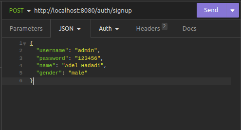

# Go Multi Language Application
this repo created for my medium article that is about creating multi-language go application so if you want more detail
about it, you can read [this](https://medium.com/p/97120749cab5).

## Run Project
Firstly should make a copy from `.env.example` and named it to `.env`. In env file
`APP_LOCAL` field define your app language that it can be one of the languages that you have in lang `folder`,
 for example in this project we have `fa` and `en`.

Then we have a Makefile that contain a run command so if you have installed it in your system
you can run `make run api` in root directory but if you are not installed it before can run go command
`go run cmd/api/main.go`.

## Endpoints

we have just a simple route group called auth and in it just a signup post route.
in `auth_service.go` we just check if username is admin return an error with message
user already exists and this message will translate to language that is set in env file.

and validation package just use go validator for validate structures and translate error messages using
translator package. If any validation tag or field name is missed,
you can just add it easily in `validations.json` file. If you want to add another language support just 
add a folder in lang directory and write messages and validation errors in this directory.
